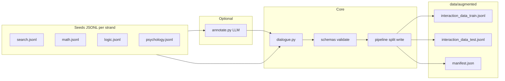

# Augmented interaction data pipeline

## Context (constraints from your codebase)

- Training loads lines with `[load_raw_dataset](src/Vagueness_Judge/training/sft.py)` from `--train_data_path`; each JSON object must include `task`, `vague`, `thought`, `missing_details`, and `actions` (roles `assistant` / `user`, types `New` / `summary`).
- `[format_one](src/Vagueness_Judge/training/sft.py)` does not consume extra keys, so records may include metadata such as `strand` or `source` for traceability without changing training.
- `[sft.sh](src/Vagueness_Judge/training/sft.sh)` passes `TRAIN_DATA_PATH`; “ready to use” means pointing it to a merged file or the augmented-only file you generate.
- No LLM client exists under `Vagueness_Judge` today; the project already depends on `requests` (`[pyproject.toml](pyproject.toml)`), so optional HTTP calls can avoid adding new required dependencies.

## Output layout

| Path                                                                         | Purpose                                                               |
| ---------------------------------------------------------------------------- | --------------------------------------------------------------------- |
| `[src/Vagueness_Judge/data/augmented/](src/Vagueness_Judge/data/augmented/)` | Generated artifacts (create directory on first run)                   |
| `interaction_data_train.jsonl`                                               | Augmented training split                                              |
| `interaction_data_test.jsonl`                                                | Augmented evaluation split                                            |
| `manifest.json`                                                              | Counts per strand, seed, CLI args, output paths (for reproducibility) |

## Package layout under `src/Vagueness_Judge/augment_data/`

| Module                   | Responsibility                                                                                                                                                                                                                                                                                                                                                               |
| ------------------------ | ---------------------------------------------------------------------------------------------------------------------------------------------------------------------------------------------------------------------------------------------------------------------------------------------------------------------------------------------------------------------------- |
| `schemas.py`             | Typed structures + JSON validation (required keys, `vague` vs `missing_details` consistency, `actions` alternation, last turn `summary`)                                                                                                                                                                                                                                     |
| `dialogue.py`            | **Deterministic** synthesis of `actions` from `vague`, `missing_details`, and `task`: sort details by `importance` (desc), emit `New` + synthetic `user` replies (pick one option per round with seeded RNG, friendly phrasing templates to match Tell Me More tone), close with a `summary` assistant turn whose `thought` lists resolved constraints                       |
| `seeds/`                 | Strand seed files (JSONL): `**search.jsonl`**, `**math.jsonl`**, `**logic.jsonl**`, `**psychology.jsonl**` — each line is an **IN3-style** record (`category`, `task`, `vague`, `thought`, `missing_details` with `description`, `importance`, `inquiry`, `options`). Clear tasks use `vague: false` and `missing_details: []`; dialogue layer emits a single summary action |
| `annotate.py` (optional) | If seeds are **task-only** (minimal fields), one-shot chat completion to produce `vague`, `thought`, `missing_details` (JSON mode). Config via env: `OPENAI_API_KEY`, optional `OPENAI_BASE_URL`, `AUGMENT_LLM_MODEL`. Uses `requests` only; fails fast with a clear message if keys missing when this mode is selected                                                      |
| `pipeline.py`            | Load seeds → optional annotate → `dialogue.build_actions` → stratified train/test split (by `strand` or `category`) → write JSONL + manifest                                                                                                                                                                                                                                 |
| `merge.py`               | Concatenate augmented train JSON with an existing file (e.g. `[interaction_data_train.jsonl](src/Vagueness_Judge/data/interactions/interaction_data_train.jsonl)`), optional shuffle with seed, write merged output path                                                                                                                                                     |
| `cli.py`                 | argparse entry: `--seeds-dir`, `--out-dir`, `--test-ratio` / `--test-per-strand`, `--seed`, `--annotate`, `--merge-with`, `--merge-output`                                                                                                                                                                                                                                   |

Entrypoint: `python src/Vagueness_Judge/augment_data/cli.py ...` from repo root (same style as `sft.py`).

## Pipeline (mermaid)

## Seed content strategy (efficient and thesis-aligned)

- Ship **enough** hand-authored IN3-style rows per strand so the default run works **without** an API (aligned with your earlier goal: math, logic, search, psychology-like).
- Keep psychology prompts **non-clinical / educational** (theories, study design, explain concepts) to reduce safety surface while still testing vagueness.
- Include **paired** variants where useful: same topic as **clear** vs **vague** wording (high signal for the judge).

## Integration with training

- Document in module docstring (no new markdown file unless you ask): set `TRAIN_DATA_PATH` to `src/Vagueness_Judge/data/augmented/interaction_data_train.jsonl` **or** to the path produced by `--merge-with` for full corpus.
- Optional: one-line comment in `[sft.sh](src/Vagueness_Judge/training/sft.sh)` showing `TRAIN_DATA_PATH` override (only if you want discoverability in shell; otherwise docstring-only).

## `.gitignore`

- Optionally ignore `src/Vagueness_Judge/data/augmented/*.jsonl` if you prefer not to commit generated data; **or** commit seeds only and gitignore outputs — your choice at implementation time (default: **do not** add ignore rules so you can commit small augmented sets for reproducibility; mention in docstring).

## Testing

- Add `tests/test_augment_data_validation.py` (or pytest under `tests/`) that loads a few synthesized lines and asserts `preprocess_data` from `[sft.py](src/Vagueness_Judge/training/sft.py)` runs without error for `MTMD` (torch import acceptable in test env) **or** lighter unit tests only on `schemas` + `dialogue` to keep tests fast — prefer **lightweight** schema/dialogue tests without loading Unsloth.

